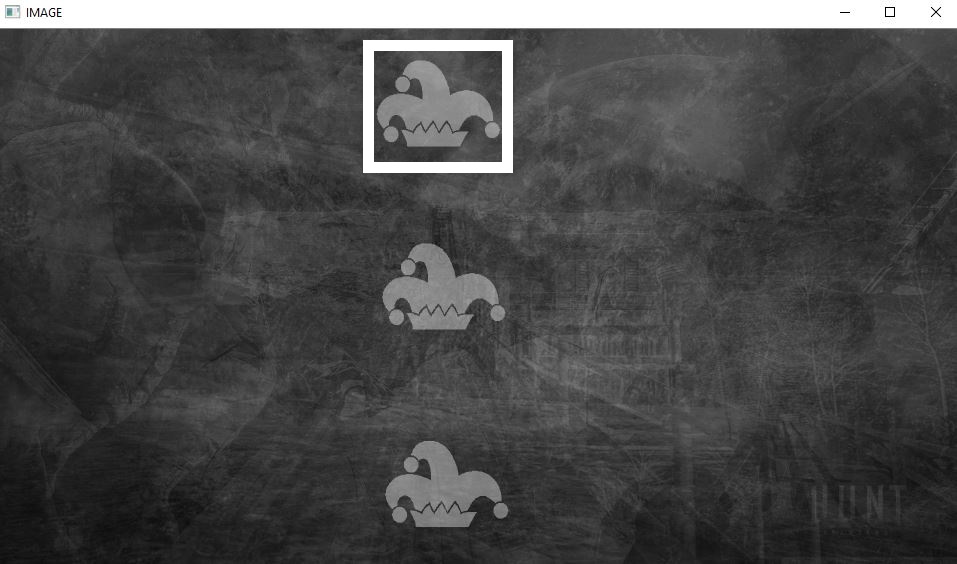

# Begone Mark

Removes monochromatic watermarks from a set of images by using a method similar to what Google describes [here](https://www.youtube.com/watch?v=02Ywt87OpS4&feature=emb_logo).  A separate image of the watermark is not needed, instead images with the <u>exact same watermark</u> are used to isolate the watermark.  Inpainting is used on the edges of the watermark where inaccuracies are likely to occur.


## Installation

Make sure you have Python3 installed on your system.  I also recommend creating a [virtual environment](https://docs.python.org/3/library/venv.html) for the project.
```
pip install-r ./requirements.txt
```

## Script instructions

Run the script using the following options:

| Option | Description |
| -- | -- |
| <b>input_dir</b> (required) | The directory containing the watermarked images (will not do a recursive search) |
| <b>output_dir</b> (required) | The directory to output the cleaned images to (will overwrite existing files with same name) |
| match_threshold | Maximum distsance parts of the image must be from the watermark to be identified as another watermark instance |
| mask_threshold | Watermark must have a greater code than this to be isolated from the image behind it |
| refine_count | # of times to repeat the watermark removal process |

The alpha value of the watermark (0-255) should be passed as an argument

## Example
To remove the watermark on all the images in the ./watermarked directory and output the results in the ./clenaed directory, run 
```
python ./begon_mark.py --input_dir=./watermarked --output_dir=./cleaned 100
```
The summation of all the image values will then be displayed in a window.  Click and drag to put a rectangle around the watermark.  If the watermark is a reoccuring image, highlight the repeating image.



Press enter or space on the window to continue the program.  Your cleaned images will be in the ./cleaned directory.